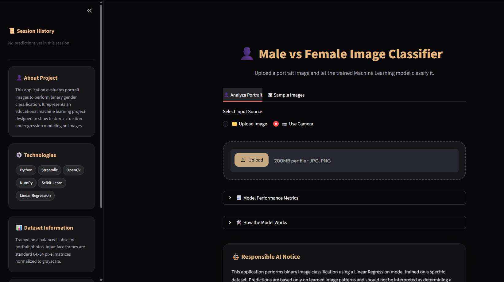
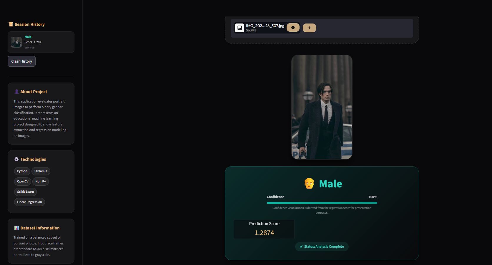

# 👤 Male vs Female Image Classifier

<p align="center">


</p>

<p align="center">

### 🚀 Upload • Analyze • Predict

*A Machine Learning project that classifies facial images as Male or Female using OpenCV, Scikit-Learn, and Streamlit.*

</p>

---

# 📸 Application Preview

| Home Screen | Prediction Result |
|-------------|-------------------|
|  |  |

---

# ✨ Features

- 📤 Drag & Drop Image Upload
- 🤖 Automatic Prediction
- 🖼️ Image Preview
- 📷 Image Analysis
- ⚡ Fast Inference
- 🌙 Modern Dark UI
- 📊 Model Information
- 💾 Pickle Model Support
- 📱 Responsive Design

---

# 🏗️ Project Architecture

```text
             ┌────────────────────┐
             │  Upload an Image   │
             └─────────┬──────────┘
                       │
                       ▼
             ┌────────────────────┐
             │ OpenCV Processing  │
             └─────────┬──────────┘
                       │
       Resize → Grayscale → Flatten
                       │
                       ▼
             ┌────────────────────┐
             │ Linear Regression  │
             └─────────┬──────────┘
                       │
                       ▼
             ┌────────────────────┐
             │ Prediction Result  │
             └────────────────────┘
```

---

# 📂 Project Structure

```text
Male_Female_Classifier/
│
├── dataset/
│   ├── Male/
│   └── Female/
│
├── app.py
├── train_model.py
├── predict.py
├── gender_model.pkl
├── requirements.txt
└── README.md
```

---

# 📁 Dataset

```text
dataset/
│
├── Male/
│     ├── 001.jpg
│     ├── 002.jpg
│     └── ...
│
└── Female/
      ├── 001.jpg
      ├── 002.jpg
      └── ...
```

---

# ⚙️ Image Processing Pipeline

```text
🖼️ Input Image
      │
      ▼
📏 Resize (64×64)
      │
      ▼
⚫ Convert to Grayscale
      │
      ▼
🧩 Flatten Pixels (4096 Features)
      │
      ▼
📊 Normalize
      │
      ▼
🧠 Linear Regression
      │
      ▼
👤 Male / Female
```

---

# 🛠️ Tech Stack

| Technology | Usage |
|------------|------|
| 🐍 Python | Programming |
| 📷 OpenCV | Image Processing |
| 🔢 NumPy | Numerical Computing |
| 📊 Pandas | Data Handling |
| 🤖 Scikit-Learn | Machine Learning |
| 🌐 Streamlit | Web Application |
| 💾 Pickle | Model Serialization |

---

# 🚀 Installation

```bash
git clone https://github.com/yourusername/male-female-classifier.git

cd male-female-classifier

pip install -r requirements.txt
```

---

# ▶️ Train Model

```bash
python train_model.py
```

Output

```text
✔ Dataset Loaded

✔ Images Processed

✔ Model Trained

✔ gender_model.pkl Created
```

---

# 🌐 Run Application

```bash
streamlit run app.py
```

---

# 📊 Model Information

| Property | Value |
|----------|-------|
| Algorithm | Linear Regression |
| Input Size | 64 × 64 |
| Color Format | Grayscale |
| Features | 4096 |
| Framework | Scikit-Learn |
| Deployment | Streamlit |

---

# 📈 Workflow


---

# 🎯 Sample Output

```text
━━━━━━━━━━━━━━━━━━━━━━━━━━━━━━

👤 Prediction

Male

Prediction Score

1.873

━━━━━━━━━━━━━━━━━━━━━━━━━━━━━━
```

---

# ⚠️ Responsible AI

> This project is developed **for educational purposes only**.

The model performs **binary image classification** using patterns learned from the training dataset.

Prediction quality depends on:

- 📷 Lighting
- 😊 Face Visibility
- 📐 Pose
- 🖼️ Image Quality
- 📚 Dataset Diversity

This application **does not determine a person's identity or gender identity.**

---

# 🚧 Future Improvements

- ✅ Logistic Regression
- ✅ Support Vector Machine
- ✅ CNN
- ✅ Face Detection
- ✅ Live Webcam
- ✅ Better Dataset
- ✅ REST API
- ✅ Docker Deployment
- ✅ Cloud Deployment

---

# 👨‍💻 Author

## Abhay Shanker Tiwari

🎓 B.Tech CSE

💻 Machine Learning Enthusiast

🚀 Building AI Projects with Python

---

<p align="center">

⭐ If you like this project, don't forget to star the repository!

</p>
